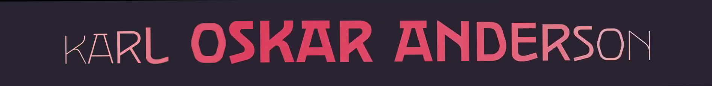
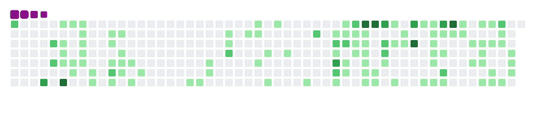

[^1]
[^1]: [This](https://raw.githubusercontent.com/oskar-anderson/oskar-anderson/main/gif/karl-oskar-anderson.mp4) was supposed to be animated, but Github did not like that. Done with [Kapsas.](https://github.com/oskar-anderson/Kapsas)
---

🌱 I’m currently finishing my bachelor's degree in IT Systems Development (IADB) at Taltech.

📌 Pinned repos
---

🐍🪛 Languages and Tools
---

<!-- 
Icons from https://simpleicons.org/ 
-->

&nbsp;  <!-- br element did not work, weird ... -->

  

🐍 Snake eating my contributions 🐍
---

💬 Fun - Pop culture Anderson quotes:
---
* "You're going to help us Mr. Anderson whether you want to or not." <cite>--Agent Smith (The Matrix)</cite>
* "Lieutenant Andeson, I must inform you that I intend to file a report on your behavior." <cite>--Connor (Detroit Become Human)</cite>
* "[Are you okay Anderson?](https://www.youtube.com/watch?v=Owrj4i2rpwc&t=112s)" <cite>--Conan O'Brien</cite>
* Do you know any more?

<!-- possible new one https://www.anisearch.com/character/95265,anderson -->

<!--
**oskar-anderson/oskar-anderson** is a ✨ _special_ ✨ repository because its `README.md` (this file) appears on your GitHub profile.

Here are some ideas to get you started:

- 🔭 I’m currently working on ...
- 🌱 I’m currently learning ...
- 👯 I’m looking to collaborate on ...
- 🤔 I’m looking for help with ...
- 💬 Ask me about ...
- 📫 How to reach me: ...
- 😄 Pronouns: ...
- ⚡ Fun fact: ...

https://emojipedia.org
-->
